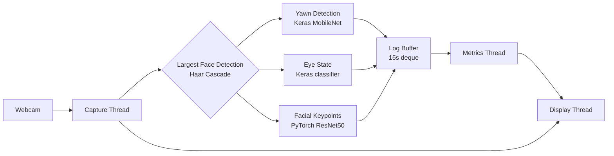
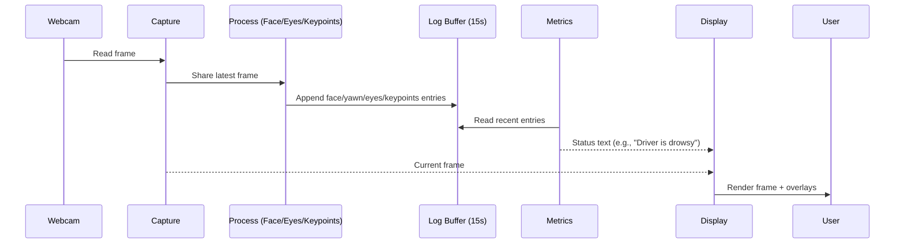

# Drowsiness State Detector

A real-time, multi-model driver monitoring system for detecting signs of drowsiness through eye state classification, facial keypoint estimation, and yawn detection. The unified demo integrates the three models, aggregates short-term metrics, and surfaces intuitive on-screen alerts.

## Table of Contents
- Overview
- Project Structure
- Prerequisites
- Quickstart (Windows)
- Models and Expected Paths
- Run the Unified Demo
- How It Works
- Running Individual Modules
- Logging
- Troubleshooting
- Performance Notes
- Datasets and Credits
- License and Citation
- Acknowledgments

## Overview
This project combines three computer vision models to infer driver drowsiness cues:
- Eye state detection (Open/Closed)
- 68-point facial keypoint estimation
- Yawn detection

The Final Union module orchestrates these components using a multi-threaded pipeline and a 15-second sliding buffer to compute stable metrics.

## Project Structure
```
Drowsiness-State-Detector/
  EyesDetection/                 # Eye open/closed model (train + launcher)
  FaceKeypointsDetection/        # 68-point facial keypoint estimator (train + webcam inference)
  YawnDetection/                 # Yawn detector (dataset tools, training, visualization)
  Final Union/                   # Real-time integration (models + visualization pipeline)
  requirements.txt               # Root runtime dependencies for the Final Union demo
```

### Submodules at a glance
- EyesDetection: uses OpenCV Haar cascades to locate eyes and a Keras model (`eyes_model.h5`) to classify Open vs Closed.
- FaceKeypointsDetection: uses `facenet-pytorch` MTCNN for face detection and a ResNet50 regressor (PyTorch) to predict 68 keypoints; checkpoint saved as `model.pth`.
- YawnDetection: provides data download/prep for YawDD and a MobileNet Keras model for yawn classification (`yawn_detection_model_mobilenet.h5`).
- Final Union: loads the three models, runs them in parallel threads on the largest detected face, aggregates results, logs to text and JSON, and overlays alerts on the webcam stream.

## Prerequisites
- Python 3.10+
- Windows 10/11 tested (Linux/macOS should work with minor path adjustments)
- Webcam available and accessible to OpenCV
- Optional: CUDA-enabled GPU for PyTorch/TensorFlow acceleration

## Quickstart (Windows)
```powershell
# 1) Create and activate a virtual environment
py -3.10 -m venv .venv
.\.venv\Scripts\Activate.ps1

# 2) Install dependencies
pip install --upgrade pip
pip install -r requirements.txt

# 3) Run the unified demo
cd "Final Union"
python .\Visualization\visualization.py
```
Press `q` to exit.

## Models and Expected Paths
Place the following files under `Final Union/Models/`:
- `eyes_model.h5`
- `model.pth` (PyTorch checkpoint: `{ 'model_state_dict': ... }`)
- `yawn_detection_model_mobilenet.h5`

Model artifacts are already provided; you can replace them with your own trained models while preserving filenames.

## Run the Unified Demo
```bash
cd "Final Union"
python ./Visualization/visualization.py
```

## How It Works
The visualization uses a multi-threaded design:
- Capture thread: reads frames from webcam.
- Processing threads: face/yawn, eyes, and keypoints run concurrently on the largest face.
- Metrics thread: aggregates a sliding 15-second buffer of logs to infer drowsiness indicators.
- Display thread: renders overlays and status messages.

### High-level architecture


### Data flow and decision logic
- Yawn: frame -> face crop -> resize (64x64) -> normalize -> Keras model -> label {Yawning | Not Yawning}
- Eyes: face -> eye ROIs (Haar) -> resize (80x80) -> normalize -> Keras model -> label {Open | Closed}
- Keypoints: face crop -> resize (224x224) -> normalize/transposes -> ResNet50 -> 68 (x,y) pairs
- Metrics (per ~1s):
  - Average yawn rate over last 15s
  - Eye-open vs eye-closed ratio (requires two eyes open)
  - Relative face rotation from keypoints
- Heuristics (simplified):
  - Drowsy if eye-open rate < 0.45 or yawn rate > 0.85 or rotation > 9.0
  - Falling asleep if rotation > 0.15 and yawn > 0.3 and eye-open < 0.5
  - Focused if small rotation, low yawn, high eye-open



## Running Individual Modules

### EyesDetection
- Training: see `EyesDetection/Final Model/mobilelowparams.py`.
- Inference (webcam): adapt paths and run the launcher.
```bash
cd EyesDetection
pip install -r requirements.txt
python 3-launch.py  # ensure model path points to Final Union/Models/eyes_model.h5
```

### FaceKeypointsDetection
- Training: `loading_and_training.py` (requires the Kaggle dataset referenced in the module README).
- Inference (webcam):
```bash
cd FaceKeypointsDetection
python inference_webcam.py  # ensure checkpoint path points to Final Union/Models/model.pth
```
Update the checkpoint path inside the script if needed.

### YawnDetection
- Training/Preparation (YawDD):
```bash
cd YawnDetection/YawnDD
python ./Training/DatasetDownloader.py
python ./Training/DatasetPreparation.py
python ./Training/ModelTraining-grayscale.py
```
- Visualization:
```bash
cd YawnDetection/YawnDD
python ./Visualization/visualization.py
```

## Logging
The unified demo writes:
- Text logs: `Final Union/detection_log.txt`
- JSON lines: `Final Union/detection_log.json`

These include per-face bounding boxes, yawn labels, eye detections, and derived geometries (e.g., eye-to-eye, nose-to-chin, rotation). In-memory, a ~15s deque powers the metrics thread.

## Troubleshooting
- Webcam not opening: verify device index in `cv2.VideoCapture(0)`; close other apps; check permissions.
- Missing models: ensure the three model files exist in `Final Union/Models/` with exact filenames.
- Import errors (PyTorch/TensorFlow): align versions with your Python and OS; for GPU, install the correct CUDA builds.
- Low FPS: run on smaller webcam resolution; ensure CPU/GPU power plan is not throttled.

## Performance Notes
- The pipeline prioritizes the largest detected face to reduce compute.
- Preprocessing sizes (64/80/224) balance speed and accuracy. Adjust with care.
- For GPU users, moving the PyTorch model to CUDA and enabling cuDNN can yield significant speedups.

## Datasets and Credits
- Yawn detection training leverages the YawDD dataset (`YawnDetection/YawnDD`) — see dataset terms.
- Facial keypoints: references the Kaggle dataset in `FaceKeypointsDetection/README.md`.
- Eye detection relies on Haar cascades included with OpenCV.

Ethical note: This project is intended for research and prototyping. It is not a safety-certified system and should not be used as a sole measure for driver safety-critical decisions.

## License and Citation
- License: add the appropriate license file for your distribution scenario.
- If you use this repository in academic work, please cite it appropriately. Example BibTeX:
```bibtex
@misc{drowsiness_state_detector,
  title        = {Drowsiness State Detector},
  howpublished = {GitHub repository},
  year         = {2024},
  note         = {\url{https://github.com/your-org/your-repo}}
}
```

## Acknowledgments
- OpenCV and its Haar cascade models
- PyTorch, torchvision (ResNet50)
- TensorFlow/Keras (MobileNet)
- facenet-pytorch (MTCNN)
- Contributors and dataset authors of YawDD and related resources
